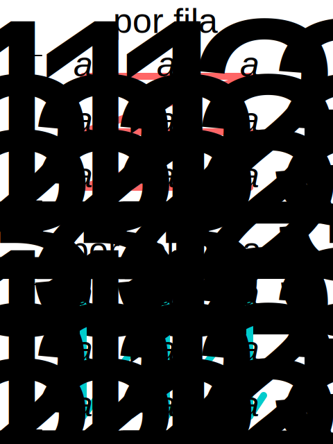

# Guía: Patrones de Diseño

Usando los patrones que se vieron en clase (_Composite_, _Adapter_, _Iterator_) resuelva los siguientes ejercicios.

1. Por un lado, tenemos a nuestra disposición una clase concreta (externa, que no podemos modificar) denominada `FileMp3` que tiene un método para reproducir archivos con la siguiente declaración:

   ```go
   func (f *FileMp3) PlayMp3() string
   ```

   Por el otro lado, necesitamos reproducir archivos de ese tipo cumpliendo con la siguiente interfaz `ArchivoDeMusica`:

   ```go
   type ArchivoDeMusica interface {
        Reproducir() string
   }
   ```

   ¿Qué patrón de los vistos en clase resuelve el problema? Utilizandolo, implementar la clase `ArchivoMp3`, capaz de cumplir con la funcionalidad solicitada. Incluya todo el código necesario para poder probar la funcionalidad solicitada.

   (La reprodución puede simularse devolviendo un mensaje de texto, tal como `“Reproduciendo archivo <archivo>”`)

2. Una fábrica de piezas para automotores compra cuatro productos básicos y con ellos construye nuevos productos. Un nuevo producto puede estar compuesto por básicos y también por otros productos ya construidos por la fábrica. Los cuatro productos básicos que compra son tornillos, tuercas, rulemanes y varillas de acero. Se necesita poder calcular el costo de producción de cada producto, donde, si se trata de un producto básico el precio es igual al precio de compra, y si se trata de un producto compuesto, el costo es la suma de todos los productos básicos que lo componen.

   Por ejemplo, supongamos que `producto1` está compuesto por un `productoA`, un `tornillo` y una `tuerca`. Entonces:

   ```text
   costo(producto1) = costo(productoA) + costo(tornillo) + costo(tuerca)
   ```

3. Se quiere construir un editor/resolvedor de expresiones matemáticas. Una expresión válida estará formada o bien por un número, o bien por la suma/resta/división/multiplicación de dos expresiones. Ejemplos de expresiones válidas son:

   ```text
   4
   3 + 8
   14 * (3 + 5)
   ```

   Revisar las pruebas para mayor detalle.

4. Se desea recorrer un array, pero visitando solamente las posiciones pares. No debe alterarse el array original. La estructura base se encuentra en el archivo `array.go`.

5. Dada la siguiente definición de una matriz de números enteros:

   ```go
   type Matriz struct {
       Filas int
       Columnas int
       Datos [][]int
   }
   ```

   - Implementar un iterador que permita recorrer la matriz por fila.
   - Implementar un iterador que permita recorrer la matriz por columna.

   

   Los iteradores deben implementar la interfaz `Iterador` definida anteriormente. Agregar más casos de prueba.

6. Implementar un iterador para recorrer una lista enlazada doblemente, es decir que permita avanzar y retroceder en el recorrido de la lista. Agregar más casos de prueba.
